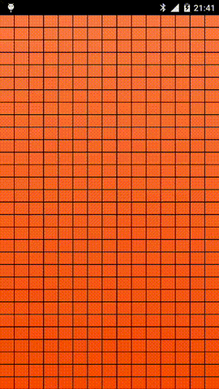

Crazy ImageView
===============

Crazy Image View for Android is a true crazy experiment, offering to the user the opportunity to discover the image touching the screen. By the way with this repository you can learn how you can work with the Canvas API on Android and see some performance tricks.



# Latest Version

[ ](https://bintray.com/txusballesteros/maven/CrazyImageView/_latestVersion)

# How to Use

### 1.- Configuring your project dependencies

Add the library dependency to your build.gradle file.

```groovy
dependencies {
    ...
    compile 'com.txusballesteros:CrazyImageView:1.0.1'
}
```

### 2.- Adding and Customizing the View

Add the view to your xml layout file.

```xml
<com.txusballesteros.CrazyImageView
    android:layout_width="match_parent"
    android:layout_height="match_parent"
    app:foregroundSrc="@drawable/foreground"
    app:backgroundSrc="@drawable/android"
    app:dividerSize="1dp"
    app:columns="15"
    app:rows="30" />
```

## License

Copyright Txus Ballesteros 2016 (@txusballesteros)

This file is part of some open source application.

Licensed to the Apache Software Foundation (ASF) under one or more contributor license agreements. See the NOTICE file distributed with this work for additional information regarding copyright ownership. The ASF licenses this file to you under the Apache License, Version 2.0 (the "License"); you may not use this file except in compliance with the License. You may obtain a copy of the License at

http://www.apache.org/licenses/LICENSE-2.0

Unless required by applicable law or agreed to in writing, software distributed under the License is distributed on an "AS IS" BASIS, WITHOUT WARRANTIES OR CONDITIONS OF ANY KIND, either express or implied. See the License for the specific language governing permissions and limitations under the License.

Contact: Txus Ballesteros txus.ballesteros@gmail.com